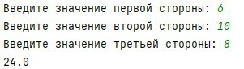

# firstrepository
# Исполнитель
Утябаев Данил \
Фт-240008
# Лабораторная работа №2 Репозиторий GitHub 
Напишите программу, которая вычисляет площадь треугольника по трём его
сторонам (по формуле Герона) с точность до сотых.   
Создайте программу-конвертер, которая переводит расстояние из одних
единиц измерения в другие. Программа должна поддерживать следующие
единицы: Километры (км), Метры (м), Сантиметры (см), Миллиметры (мм),
Мили (mi), Ярды (yd).    
Напишите программу, которая определяет, является ли введенный год високосным.
# Среда разработки
Язык программирования: Python.  
Среда разработки: PyCharm Community Edition 2023
# Инструкция по работе
Пользователь вводит три числа. Числа могут быть как целыми, так и дробными. 
Результат должен быть выведен с двумя знаками после запятой.  
Пользователь выбирает исходную единицу измерения. Пользователь выбирает целевую единицу измерения.
Программа запрашивает значение для конвертации. Выводится результат.  
Программа должна запрашивать у пользователя ввод года. 
Необходимо использовать условные операторы. Должен выводиться результат.
# Результаты тестирования
Три теста первого задания:  
  
  
  
Тесты второго задания:  
  
  
  
Результаты выполнения третьего задания:  
  
  
  
